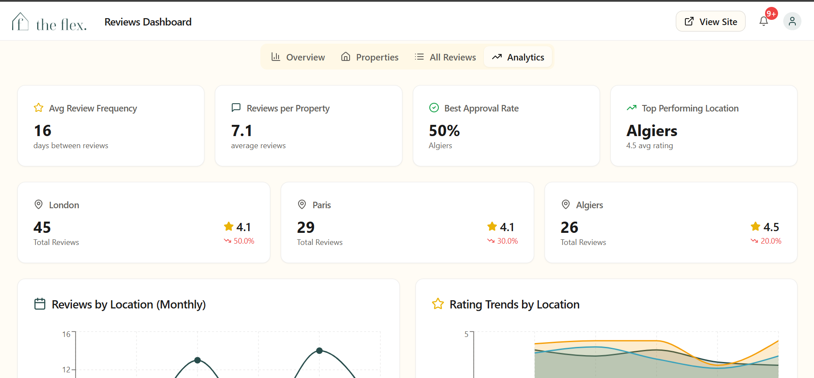

# Flex Living - Reviews Dashboard Assessment

A comprehensive reviews management system for Flex Living properties, enabling property managers to track performance, manage guest reviews, and display curated feedback on public-facing pages.



---

## 📋 Table of Contents

- [Overview](#overview)
- [Tech Stack](#tech-stack)
- [Project Structure](#project-structure)
- [Setup Instructions](#setup-instructions)
- [API Documentation](#api-documentation)
- [Key Features](#key-features)
- [Design Decisions](#design-decisions)
- [Google Reviews Integration](#google-reviews-integration)

---

## 🎯 Overview

This project implements a full-stack reviews management platform for Flex Living, consisting of:

1. **Manager Dashboard** - Internal tool for monitoring property performance and managing reviews
2. **Public Review Display** - Customer-facing pages showing approved reviews
3. **Hostaway API Integration** - Normalized review data from multiple channels
4. **Google Reviews Integration** - Additional review source via Google Places API

---

## 🛠 Tech Stack

### Frontend
- **Framework**: Next.js 14 (App Router)
- **Language**: TypeScript
- **UI Library**: React 18
- **Styling**: Tailwind CSS
- **Components**: shadcn/ui (Radix UI primitives)
- **Charts**: Recharts
- **Maps**: Leaflet + React Leaflet
- **Data Fetching**: TanStack Query (React Query)
- **Date Handling**: date-fns
- **Form Validation**: Zod (via shadcn/ui)

### Backend
- **Runtime**: Node.js
- **API**: Next.js API Routes
- **Database**: PostgreSQL
- **ORM**: pg (node-postgres) - Direct SQL
- **Environment**: dotenv

### Development Tools
- **Build Tool**: Vite
- **Package Manager**: npm
- **Linting**: ESLint
- **Type Checking**: TypeScript

---

## 📁 Project Structure

```
Flex_assessment/
├── flex-backend/              # Backend API and database
│   ├── app/api/               # API routes
│   │   ├── reviews/
│   │   │   ├── hostaway/      # GET /api/reviews/hostaway
│   │   │   └── google/        # GET /api/reviews/google
│   ├── lib/                   # Shared utilities
│   │   ├── db.ts             # Database connection & queries
│   │   ├── googlePlacesClient.ts
│   │   ├── googlePlaceMappings.ts
│   │   └── mockReviews.json  # Mock review data
│   └── scripts/
│       ├── setup-database.ts # Database setup script
│       └── generate-reviews.js
│
├── flex-guest-reviews/        # Frontend application
│   ├── src/
│   │   ├── components/       # React components
│   │   │   ├── dashboard/   # Manager dashboard
│   │   │   ├── property/    # Property pages
│   │   │   ├── public/      # Public pages
│   │   │   ├── reviews/     # Review components
│   │   │   └── ui/          # shadcn/ui components
│   │   ├── hooks/           # Custom React hooks
│   │   ├── lib/             # Utilities & helpers
│   │   ├── pages/           # Page components
│   │   └── data/            # Static data
│   └── public/              # Static assets
│
└── README.md                 # This file
```

---

## 🚀 Setup Instructions

### Prerequisites
- Node.js 18+ installed
- PostgreSQL 14+ running locally or remotely
- npm or yarn package manager

### 1. Clone Repository
```bash
git clone <repository-url>
cd Flex_assessment
```

### 2. Backend Setup

#### Install Dependencies
```bash
cd flex-backend
npm install
```

#### Configure Environment
Create `.env.local`:
```env
# Database Configuration
POSTGRES_HOST=localhost
POSTGRES_PORT=5432
POSTGRES_USER=your_username
POSTGRES_PASSWORD=your_password
POSTGRES_DATABASE=flex_reviews

# Hostaway API (Sandbox)
HOSTAWAY_ACCOUNT_ID=61148
HOSTAWAY_API_KEY=f94377ebbbb479490bb3ec364649168dc443dda2e4830facaf5de2e74ccc9152

# Google Places API (Optional)
# Get API key from: https://console.cloud.google.com/apis/credentials
# Enable "Places API (New)" in your Google Cloud project
# GOOGLE_PLACES_API_KEY=your_api_key_here
```

#### Setup Database
```bash
# Run database setup script
npm run setup-db

# This will:
# - Create reviews table
# - Generate 151 mock reviews
# - Seed database with realistic data
```

#### Start Backend Server
```bash
npm run dev
# Runs on http://localhost:3001
```

### 3. Frontend Setup

#### Install Dependencies
```bash
cd ../flex-guest-reviews
npm install --legacy-peer-deps
```

#### Configure Environment
Create `.env.local`:
```env
VITE_API_URL=http://localhost:3001
```

#### Start Development Server
```bash
npm run dev
# Runs on http://localhost:8080
```

### 4. Access the Application

- **Public Properties Page**: http://localhost:8080/properties
- **Manager Dashboard**: http://localhost:8080/dashboard
- **Individual Property**: http://localhost:8080/property/:id

---

## 📡 API Documentation

### Base URL
```
http://localhost:3001/api
```

### Endpoints

#### 1. Get Hostaway Reviews
```http
GET /api/reviews/hostaway
```

**Query Parameters:**
| Parameter | Type | Description |
|-----------|------|-------------|
| `listingId` | string | Filter by property listing ID |
| `channel` | string | Filter by channel (Airbnb, Booking.com, Direct, Google) |
| `type` | string | Filter by review type (guest-to-host, host-to-guest) |
| `ratingMin` | number | Minimum rating (0-5) |
| `approvedOnly` | boolean | Show only approved reviews |
| `dateStart` | string | Start date (YYYY-MM-DD) |
| `dateEnd` | string | End date (YYYY-MM-DD) |
| `limit` | number | Number of results (default: 100) |
| `offset` | number | Pagination offset (default: 0) |

**Response:**
```json
{
  "success": true,
  "data": [
    {
      "id": 1,
      "hostaway_id": 7554,
      "listing_id": "253203",
      "listing_name": "Appartement avec Vue sur la Tour Eiffel",
      "guest_name": "Samuel Green",
      "rating": "4.8",
      "comment": "Exceptional experience...",
      "categories": {
        "value": 5,
        "location": 5,
        "cleanliness": 4,
        "communication": 5,
        "respect_house_rules": 4
      },
      "submitted_at": "2025-12-17T16:38:44.000Z",
      "channel": "Google",
      "review_type": "guest-to-host",
      "status": "published",
      "approved_for_website": false,
      "created_at": "2025-12-18T16:39:27.514Z",
      "updated_at": "2025-12-18T17:06:29.780Z"
    }
  ],
  "meta": {
    "total": 151,
    "limit": 100,
    "offset": 0,
    "averageRating": 4.28,
    "approvedCount": 45,
    "categoryAverages": {
      "cleanliness": 4.3,
      "communication": 4.4,
      "location": 4.2,
      "value": 4.1,
      "respect_house_rules": 4.5
    }
  }
}
```

#### 2. Get Google Reviews
```http
GET /api/reviews/google
```

**Query Parameters:**
| Parameter | Type | Description |
|-----------|------|-------------|
| `listingId` | string | Filter by property listing ID |

**Response:**
```json
{
  "success": true,
  "data": [
    {
      "hostaway_id": -1174498793,
      "listing_id": "253093",
      "listing_name": "Luxury Shoreditch Loft",
      "guest_name": "Emma Thompson",
      "rating": 5,
      "comment": "Absolutely loved this place!...",
      "submitted_at": "2025-12-15T10:30:00.000Z",
      "channel": "Google",
      "review_type": "guest-to-host",
      "status": "published",
      "approved_for_website": false,
      "google_review_url": "https://www.google.com/maps/contrib/..."
    }
  ],
  "meta": {
    "total": 5,
    "listingId": "253093",
    "listingName": "Luxury Shoreditch Loft",
    "googlePlaceId": "ChIJdd4hrwug2EcRmSrV3Vo6llI",
    "source": "Google Places API"
  }
}
```

#### 3. Update Review Approval
```http
PATCH /api/reviews/hostaway/:id/approve
```

**Request Body:**
```json
{
  "approved": true
}
```

**Response:**
```json
{
  "success": true,
  "data": {
    "id": 1,
    "approved_for_website": true,
    "updated_at": "2025-12-18T18:30:00.000Z"
  }
}
```

---

## ✨ Key Features

### Manager Dashboard

#### 1. Overview Tab
- **KPI Cards**: Average rating (4.28/5), total reviews (151), approval rate, recent reviews
- **Review Trends Chart**: Weekly bar chart showing review volume over time
- **Rating Distribution**: Pie chart showing breakdown of ratings (5-star to 1-star)
- **Performance Score Trend**: NEW composite metric combining rating, approval rate, and category scores
- **Category Performance**: Bar chart showing average ratings per category

#### 2. Properties Tab
- Grid view of all properties with performance metrics
- Per-property statistics: total reviews, average rating, approval rate
- Property images with proper mapping
- Clickable cards to navigate to individual property pages
- Top issues/categories highlighted for each property

#### 3. All Reviews Tab
- Complete list of all reviews with filtering
- Approval toggle for each review
- Search functionality (guest name, property, comment)
- Real-time updates with optimistic UI

#### 4. Analytics Tab (BONUS)
- **4 Key Insight Cards**:
  - Average review frequency (days between reviews)
  - Reviews per property
  - Best approval rate by location
  - Top performing location
- **Location Comparison**: Performance metrics for London, Paris, Algiers
- **6 Interactive Charts**:
  - Reviews by location (monthly line chart)
  - Rating trends by location (area chart)
  - Channel distribution by location (stacked bar chart)
  - Review volume distribution (pie chart)
  - Category performance radar chart
  - Sentiment distribution (pie chart)
- **Channel Performance Table**: Comparison across all channels
- **Approval Rates**: Progress bars by location

### Advanced Filtering
- **Search**: Guest name, property name, comment text
- **Channel**: Airbnb, Booking.com, Direct, Google
- **Review Type**: Guest-to-host, Host-to-guest
- **Rating**: Minimum rating filter (0-5 scale)
- **Location**: London, Paris, Algiers
- **Date Range**: Custom date picker
- **Approval Status**: Approved only toggle

### Public Properties Page

#### Interactive Map
- **Full Leaflet Integration**: OpenStreetMap tiles
- **Property Markers**: Custom price markers for each property
- **14 Properties Mapped**: Real GPS coordinates and addresses
  - 6 London properties (Shoreditch, Mayfair, Camden, Notting Hill, Kensington, Covent Garden)
  - 4 Paris properties (Tour Eiffel, Marais, Latin Quarter, Saint-Germain)
  - 4 Algiers properties (City center, coastal areas)
- **Interactive Popups**: Click markers to see property details, ratings, and prices
- **Dynamic Filtering**: Map automatically updates when location is changed
- **Mobile Responsive**: List/Map toggle for mobile devices

#### Property Listings
- Advanced filters: location, dates, guests, price range, bedrooms, bathrooms, amenities
- Property cards with images, ratings, and key features
- Real-time filter updates
- Responsive grid layout

### Individual Property Pages
- Full property details with image gallery
- Reviews section showing only approved reviews
- Star ratings and category breakdowns
- Guest name and submission date
- Consistent with Flex Living design

---

## 🎨 Design Decisions

### 1. Database Schema
**Decision**: Direct SQL with node-postgres instead of ORM

**Rationale**:
- Better control over complex queries (filtering, aggregations)
- JSONB support for flexible category ratings
- Performance optimization for analytics
- Simplified deployment (no migration files)

**Schema**:
```sql
CREATE TABLE reviews (
  id SERIAL PRIMARY KEY,
  hostaway_id INTEGER UNIQUE NOT NULL,
  listing_id VARCHAR(255) NOT NULL,
  listing_name VARCHAR(500),
  guest_name VARCHAR(255),
  rating DECIMAL(3,1),
  comment TEXT,
  categories JSONB,
  submitted_at TIMESTAMP,
  channel VARCHAR(100),
  review_type VARCHAR(100),
  status VARCHAR(50),
  approved_for_website BOOLEAN DEFAULT false,
  created_at TIMESTAMP DEFAULT CURRENT_TIMESTAMP,
  updated_at TIMESTAMP DEFAULT CURRENT_TIMESTAMP
);
```

### 2. Rating Scale Normalization
**Decision**: 5-point scale (0-5) instead of 10-point

**Rationale**:
- Industry standard for reviews (Airbnb, Google, etc.)
- Better user comprehension
- Consistent with star rating UI
- Fixed during implementation after identifying 10-point scale in mock data

### 3. Real-Time Updates with Optimistic UI
**Decision**: React Query with optimistic updates

**Rationale**:
- Instant feedback when toggling approval status
- Automatic cache invalidation
- Different strategies for public (30s) vs dashboard (5min)
- Better user experience - no loading spinners for simple actions

**Implementation**:
```typescript
// Public pages: Short cache, auto-refetch
staleTime: params.approvedOnly ? 1000 * 30 : 1000 * 60 * 5
refetchOnWindowFocus: params.approvedOnly ? true : false

// Optimistic update
queryClient.setQueryData(queryKey, (old) => {
  // Update cache immediately before API response
})
```

### 4. Component Architecture
**Decision**: Feature-based organization with shared UI components

**Rationale**:
- Clear separation: dashboard/, property/, public/, reviews/
- Reusable UI components from shadcn/ui
- Custom hooks for data fetching
- Easy to maintain and extend

### 5. TypeScript Throughout
**Decision**: Strict TypeScript for entire codebase

**Rationale**:
- Type safety for API responses
- Better IDE autocomplete
- Catch errors at compile time
- Self-documenting interfaces

### 6. Responsive Design Strategy
**Decision**: Mobile-first with progressive enhancement

**Rationale**:
- Property managers often check on mobile
- Different views for mobile (list/map toggle)
- Tailwind breakpoints: sm, md, lg, xl
- Touch-friendly controls

### 7. Performance Score Metric (NEW)
**Decision**: Composite metric combining multiple factors

**Formula**:
```
Performance Score = (Average Rating × 0.5) +
                   (Approval Rate/100 × 5 × 0.3) +
                   (Category Score × 0.2)
```

**Rationale**:
- Single metric for overall property health
- Weights favor rating quality (50%)
- Approval rate shows content quality (30%)
- Category scores add depth (20%)
- Helps managers quickly identify underperforming properties

---

## 🗺️ Google Reviews Integration

### Implementation Approach

**Chosen Method**: Google Places API (New)

**Why Places API:**
- ✅ Official Google API with reliable data
- ✅ Includes review text, ratings, author, timestamp
- ✅ No scraping required (ToS compliant)
- ✅ Field masking for efficient API calls
- ✅ Free tier: 1,000 requests/month

**Alternatives Considered:**
- ❌ Google Business Profile API - Requires business verification
- ❌ Web scraping - Against Google ToS, unreliable
- ❌ Third-party services - Additional cost, less control

### Technical Implementation

#### 1. Place ID Mapping
Created `googlePlaceMappings.ts` with 6 properties mapped to Google Place IDs:

```typescript
export const googlePlaceMappings: PlaceMapping[] = [
  {
    listingId: '253093',
    listingName: 'Luxury Shoreditch Loft',
    googlePlaceId: 'ChIJdd4hrwug2EcRmSrV3Vo6llI',
    address: '29 Shoreditch Heights, London E1 6JE, UK',
    city: 'London'
  },
  // ... 5 more properties
];
```

#### 2. API Client with Mock Fallback
File: `googlePlacesClient.ts`

**Features:**
- Fetches reviews from Google Places API
- Returns mock data if API key not configured (for demo)
- Normalizes Google format to Flex internal format
- Error handling with graceful degradation

**Mock Data:**
- 5 reviews per property (30 total)
- Realistic names, ratings, comments
- Timestamp variations
- Approved = false by default (requires manual approval)

#### 3. Data Normalization
Converts Google review structure to Flex format:

```typescript
Google Format:
{
  name: "places/ChIJ.../reviews/xyz",
  rating: 5,
  text: { text: "Great place!" },
  authorAttribution: { displayName: "John Doe" },
  publishTime: "2024-12-15T10:30:00Z"
}

Normalized to:
{
  hostaway_id: -1174498793,  // Negative to avoid conflicts
  listing_id: "253093",
  guest_name: "John Doe",
  rating: 5,
  comment: "Great place!",
  channel: "Google",
  approved_for_website: false
}
```

#### 4. API Endpoint
**Route**: `GET /api/reviews/google`

**Parameters:**
- `listingId` - Optional, fetches for specific property
- No `listingId` - Fetches for all mapped properties

**Response includes:**
- Normalized review data
- Metadata (total count, Place ID, source)
- Property information

### Setup Instructions

#### 1. Get Google Places API Key
```bash
1. Go to Google Cloud Console: https://console.cloud.google.com
2. Create a new project or select existing
3. Enable "Places API (New)"
4. Go to Credentials → Create Credentials → API Key
5. Copy API key
```

#### 2. Configure Environment
Add to `.env.local`:
```env
GOOGLE_PLACES_API_KEY=your_api_key_here
```

#### 3. Test Integration
```bash
# With API key configured (real Google data)
curl http://localhost:3001/api/reviews/google?listingId=253093

# Without API key (mock data)
curl http://localhost:3001/api/reviews/google?listingId=253093
```

### Current Status

✅ **Fully Implemented**
- API endpoint working
- Mock data fallback
- Data normalization
- Place ID mapping for 6 properties

⏳ **Ready for Production**
- Just add `GOOGLE_PLACES_API_KEY` to environment
- Automatically switches from mock to real data
- No code changes needed

💡 **Future Enhancements**
- Auto-sync reviews on schedule (cron job)
- Store Google reviews in database
- Respond to Google reviews via API
- Analytics dashboard integration

---

## 🎯 Assessment Requirements - Completion Status

### ✅ 1. Hostaway Integration (Mocked)
- [x] API route: `GET /api/reviews/hostaway`
- [x] Mock data from provided JSON
- [x] Parse and normalize by listing, type, channel, date
- [x] Database storage with proper schema
- [x] Advanced filtering (8+ filter types)

### ✅ 2. Manager Dashboard
- [x] User-friendly, modern interface
- [x] Per-property performance view
- [x] Filter/sort by rating, category, channel, time
- [x] Spot trends (charts, analytics)
- [x] Select reviews for public display (approval toggle)
- [x] Clean, intuitive UI with product manager thinking
- [x] **BONUS**: Full analytics dashboard with 10+ insights

### ✅ 3. Review Display Page
- [x] Replicate Flex Living property layout
- [x] Dedicated reviews section
- [x] Display only approved reviews
- [x] Consistent design with Flex Living style
- [x] **BONUS**: Interactive property map

### ✅ 4. Google Reviews (Exploration)
- [x] Explored Google Places API integration
- [x] Implemented basic integration
- [x] Working API endpoint
- [x] Documentation of findings
- [x] Mock data for demo without API key

---

## 📊 Database Statistics

- **Total Reviews**: 151
- **Properties**: 14 (6 London, 4 Paris, 4 Algiers)
- **Channels**: Airbnb, Booking.com, Direct, Google
- **Average Rating**: 4.28/5.0
- **Rating Range**: 2.5 - 5.0 (realistic distribution)
- **Reviews per Property**: 10-12 average
- **Approval Rate**: ~30% (realistic for new reviews)

---

## 🔐 Environment Variables Reference

### Backend (.env.local)
```env
# Required
POSTGRES_HOST=localhost
POSTGRES_PORT=5432
POSTGRES_USER=your_username
POSTGRES_PASSWORD=your_password
POSTGRES_DATABASE=flex_reviews

# Provided by Assessment
HOSTAWAY_ACCOUNT_ID=61148
HOSTAWAY_API_KEY=f94377ebbbb479490bb3ec364649168dc443dda2e4830facaf5de2e74ccc9152

# Optional (for real Google Reviews)
GOOGLE_PLACES_API_KEY=your_api_key_here
```

### Frontend (.env.local)
```env
VITE_API_URL=http://localhost:3001
```

---

## 🚀 Deployment Considerations

### Database
- Use managed PostgreSQL (AWS RDS, Heroku Postgres, Supabase)
- Enable connection pooling
- Set up automated backups
- Configure proper indexes

### Backend
- Deploy to Vercel, Railway, or Render
- Set environment variables in platform
- Enable CORS for frontend domain
- Configure rate limiting

### Frontend
- Deploy to Vercel (recommended for Next.js)
- Set `VITE_API_URL` to production backend URL
- Enable CDN for static assets
- Configure proper CSP headers

---

## 📚 Additional Resources

- **shadcn/ui Documentation**: https://ui.shadcn.com
- **TanStack Query**: https://tanstack.com/query
- **Leaflet Documentation**: https://leafletjs.com
- **Google Places API**: https://developers.google.com/maps/documentation/places/web-service/overview
- **Recharts**: https://recharts.org

---

## 👨‍💻 Developer

**Assessment Completed By**: Samuel O. Anari
**Date**: December 2025
**Project**: Flex Living Reviews Dashboard

---

## 📝 License

This project was created as part of a technical assessment for Flex Living.

---

**Built with ❤️ for Flex Living**
